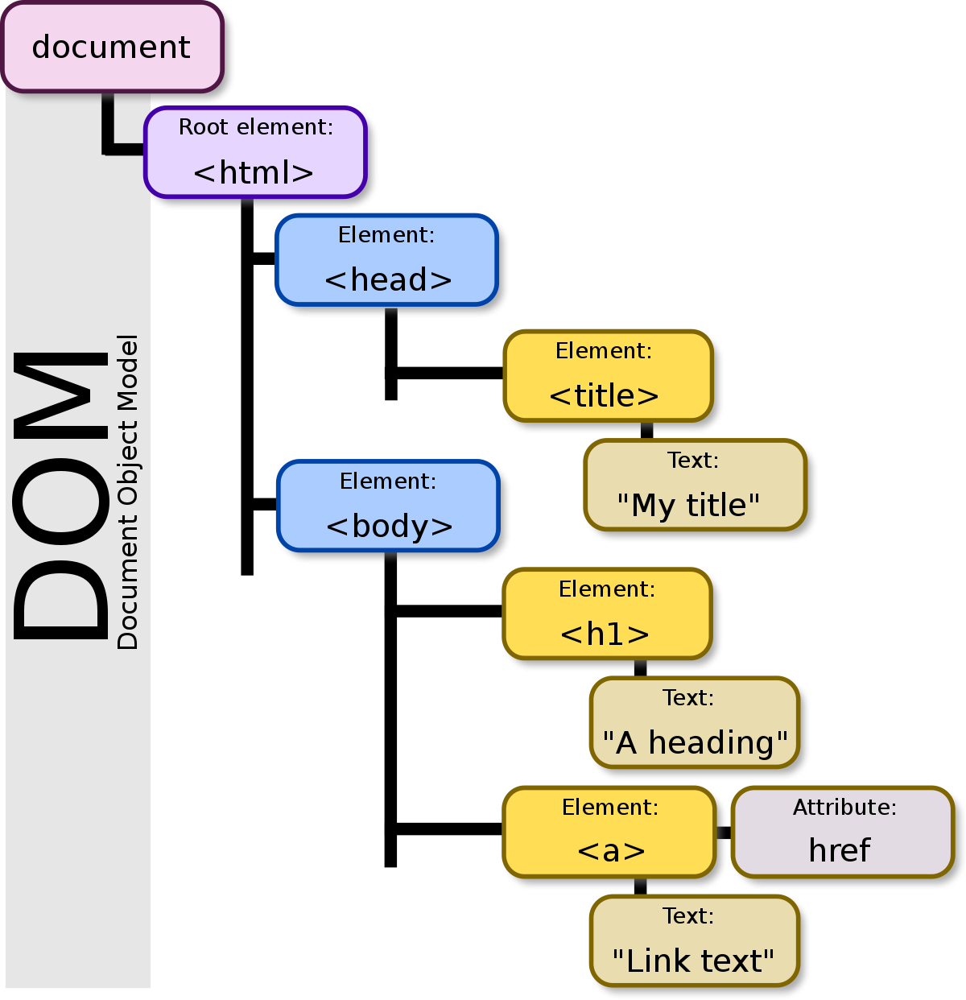

# wanted-pre-onboarding-frontend-challenge-19
3월 프론트엔드 프리온보딩 과정을 위한 사전과제입니다. 


## 📁 디렉토리 설명
```
/src
  /components
    /Task
  /store
    /slices
    /store
  /design-system 
  /utils
      /constants
  /hooks
  App.tsx
  index.tsx
```  

## 🔥 과제에 대한 설명
- `styled-components`를 활용한 디자인시스템을 구축하고자 했습니다.
- `Redux-toolkit`을 활용한 전역 상태 관리를 적용하였습니다. 

- repository clone 이후, 아래 명령어를 수행해 애플리케이션을 
```
yarn install
yarn dev
```

## 과제 1. todo list 만들기
- [x] input 창에 to-do task를 입력할 수 있습니다.
- [x] input을 입력한 뒤에 Add 버튼을 누르면 input 하단에 입력한 task가 뜹니다.
- [x] 각 task에서 Delete 버튼을 누르면 해당 컴포넌트가 삭제됩니다.

## 과제 2. 프론트엔드 질문에 답하기

```
1. DOM과 Virtual DOM을 설명해주세요.
2. 리액트의 특징을 설명해주세요.
3. flux 패턴에 대하여 설명해주세요.
4. 상태관리에 대하여 설명해주세요.
5. 궁금한 것에 대하여 알려주세요.
```

## 1. DOM과 Virtual DOM

**DOM(Document Object Model)**  
HTML을 담고 있는 웹페이지는 Document라고 불립니다. 브라우저는 이 Document를 분석해 사용자에게 페이지 화면을 그려줍니다. 

DOM이란, 이 HTML Element들을 Tree의 형태로 표현한 구조입니다. 



DOM 내부의 모든 HTML 태그들은 객체로 이루어져있으며, 모든 객체들은 자바스크립트를 통해 접근할 수 있습니다. 따라서 브라우저 상에서 페이지를 조작할 땐, 객체를 사용하여 조작합니다.

예를 들어, `document.body`는 페이지 document의 `<body>` 태그를 객체로 표현한 것입니다.


Virtual DOM이란 UI의 가상적인 표현을 메모리에 저장하고, ReactDOM 라이브러리를 통해 **실제 DOM과 동기화**하는 프로그래밍 개념입니다. 이 과정을 **재조정(Reconciliation)**이라 부릅니다.

[참고 - 모던 Javascript 튜토리얼](https://ko.javascript.info/dom-nodes)

React application은 현재 상태의 VDOM과 상태 변경이 일어난 VDOM을 비교해 빠르고 효율적인 렌더링을 구현하고자 설계되어 있습니다.

하나의 트리를 가지고 다른 트리로 변환하기 위해 최소한의 연산을 구하는 일반적인 해결책들은 `O(n^3)`의 복잡도를 가집니다. 하지만, Facebook의 React 개발팀은 `O(n)`시간에 두 트리를 비교하기 위해서 [Diffing Algorithm](https://ko.legacy.reactjs.org/docs/reconciliation.html#the-diffing-algorithms)을 적용했습니다.

짧게 설명하면 아래와 같습니다.
1. 이전의 VDOM과 새 VDOM 트리를 비교
2. Root node에서 시작하여 이전 node와 새로운 node를 비교
3. 두 노드가 다른 유형이라면 새 노드를 만들어 기존 노드를 대체
4. 두 노드가 같은 유형이라면 속성을 비교하여 변경 내역을 확인  
  4.1. 변경된 속성이 있다면 해당 속성을 업데이트
  4.2. 변경된 속성이 없다면 해당 노드를 그대로 사용
5. 자식 노드를 재귀적으로 비교

[React docs Virtual DOM](https://ko.legacy.reactjs.org/docs/faq-internals.html)

## 2. 리액트의 특징

대표적인 특징은 아래와 같습니다.

**1. 선언적 프로그래밍을 활용한 UI 구성**
- `JSX` 파일을 사용해, 애플리케이션의 상태에 대한 뷰를 설계하고 데이터 변경에 따라 동적인 화면 UI를 구현할 수 있습니다. 
- 이러한 선언적 방식은 개발자에게 높은 가독성과 직관성을 제공합니다.


**2. Single Page Application**

- 단일 HTML 파일을 기반으로, 인터랙션 등 필요시 js를 이용해 동적으로 컨텐츠를 바꾸는 웹 애플리케이션을 만들 수 있습니다.
- 라우팅 동작에 있어, 비동기적으로 페이지에 필요한 js를 로드해 부분적으로 페이지를 변경합니다.
- History API 등, 브라우저의 API를 활용해 라우팅이 동작합니다.

**3. Virtual DOM으로 인한 빠른 렌더링**
- 앞에서 알아본 바와 같이, React의 설계는 VDOM을 활용해 


## 3. Flux 패턴이란

Flux는 meta(구 facebook)에서 클라이언트사이드 웹 어플리케이션을 만들기 위해 사용했던 어플리케이션 아키텍쳐입니다. 

Flux application은 `dispatcher`, `stores`, `views (React components)`로 구성된 3가지 메인 파트를 갖고 있다 :이는 MVC pattern과 유사하지만, Flux엔 Contoller가 존재하지 않는다는 점에서 다릅니다.

Flux의 구조는 단방향입니다. View에서 Action을 호출하면 Dispatcher를 통해 Store에 Data가 보관되고 이 Data는 다시 View로 전달됩니다.

이러한 Flux 구조는 함수형 반응 프로그래밍을 다시 재현하는 것을 쉽게 만들거나 데이터-흐름 프로그래밍, 흐름 기반 프로그래밍을 쉽게 만들어줍니다.

 어플리케이션의 상태는 오직 store에 의해서만 관리되고 어플리케이션의 다른 부분들과는 완전히 분리됩니다. store 사이에 의존성이 발생하더라도 엄격한 위계의 dispatcher에 의해 동기적으로 관리합니다.


[Meta archive, Flux](https://facebookarchive.github.io/flux/)

## 4. 상태관리란

위 Flux 패턴에서 살펴본 것과 같이, 기존 아키텍쳐에서 컴포넌트가 가진 상태를 완전히 분리하면서 이 개념을 `State Management (상태관리)`라고 부르게 되었습니다.

기존 아키텍처 패턴들과의 차이점을 정리하면 아래와 같습니다.

- 공통적으로 사용되는 "Business logic Layer"와 "View Layer"를 완전히 분리하여 관리합니다.

- 각각의 독립된 컴포넌트가 아니라 하나의 거대한 View 영역으로 간주합니다.

- 둘 사이의 관계는 Action과 Reduce라는 인터페이스로 분리하며 Controller는 양방향이 아니라 단반향으로 Cycle을 이루도록 설계합니다.

이러한 개념 아래 React18부터는 `ContextAPI`를 활용한 상태 관리가 공식적으로 도입되었습니다. 

이외의 상태관리 라이브러리로는 `Recoil`, `Zustand`, `Jotai` 등이 존재합니다.

[벨로그 공부 자료](https://velog.io/@naro-kim/React-%EC%83%81%ED%83%9C%EA%B4%80%EB%A6%AC%EC%9D%98-%EC%97%AD%EC%82%AC-TIL)  


### 5. 프리온보딩 FE 3월 챌린지에 대해 궁금한 것
